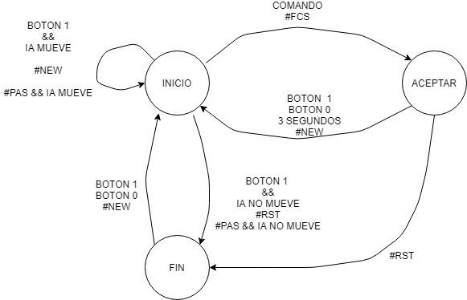

\newpage

# Introducción

En este documento se presenta la memoria técnica correspondiente a las prácticas 2 y 3 de
la asignatura Proyecto Hardware. A lo largo del documento se detalla el proceso de implementación
del conocido juego Reversi. Partiendo del proyecto en lenguaje c previamente optimizado en 
la práctica 1 se realizan una serie de modificaciones y adaptaciones, añadiendo nuevas 
funcionalidades y permitiendo que este pueda ser ejecutado en un emulador de máquina
real con sus periféricos, como pueden ser botones, leds, teclado, pantalla, etc. 

Algunas partes del código serán desarrolladas en lenguaje `ARM` y otras en `c` para finalmente
ser todo ello ejecutado con la ayuda de un emulador del procesador *ARM LPC2105*. El entorno 
de desarrollo empleado es *uVision IDE*.

# Librerías
## Botones (EINT0, EINT1)

Para simular los botones del juego se emplean dos de las líneas de interrupción externas con 
las que cuenta el chip: `EINT0` y `EINT1`. Estas permiten interaccionar al procesador con 
dispositivos de E/S. Para usarlas hay que conectarlas a los pines del sistema (GPIO). 

Para establecer la función de los pines, el procesador incluye los registros `PINSEL0` y `PINSEL1`,
los cuales son configurados al comienzo de la partida.

Al botón `EINT0` le corresponde el pin 16 (P0.16), para conectarlo se le da un valor de 1 a 
los bits 1:0 de `PINSEL1`.

```c
  PINSEL1 = PINSEL1 & 0xfffffffC; // Se limpian los bits 1:0
  PINSEL1 = PINSEL1 | 1;          // 01 en los bits 1:0 para EINT0
```

Por otro lado, para conectar el botón `EINT1` con el P0.14 se da un valor de 2 a los bits 29:28 de `PINSEL0`.

```c
  PINSEL0 = PINSEL0 & 0xcfffffff; // Se Limpian los bits 29:28
  PINSEL0 = PINSEL0 | 0x20000000; // 10 en los bits 29:28 para EINT1
```

Además, para que estas interrupciones puedan llegar es necesario habilitarlas en el vector
de IRQs, para ello se cuenta con `VicVectEnable`.

La `EINT0` corresponde con la interrupción número 14 

```c
  VICVectCntl2 = 0x20 | 14;
  VICIntEnable = VICIntEnable | 0x00004000; // Enable EXTINT0 Interrupt
```

y la `EINT1` con la interrupción número 15

```c
  VICVectCntl3 = 0x20 | 15;
  VICIntEnable = VICIntEnable | 0x00008000; // Enable EXTINT1 Interrupt
```

Las interrupciones se activan por nivel y son activas a baja: es decir que si hay 
un cero se activa la solicitud de interrupción a la que se ha conectada ese pin. 

Cuando una de las dos interrupciones llega --un botón se ha pulsado--, el programa 
entra en la rutina de servicio que se le ha especificado en el `VicVectAddr`. En 
ese momento, indica al gestor que el evento que ha sucedido mediante el envío de un `EV_BOTON`, no
sin antes deshabilitar la interrupción externa correspondiente en el VIC, para 
evitar que interrumpa de nuevo mientras no haya terminado la gestión de la pulsación.

Como las interrupciones son muy rápidas y un botón puede estar bastante tiempo
presionado, si no se hace algo una misma pulsación puede generar multitud de 
interrupciones. Por evitarlo la cola de eventos deberá encargarse de comprobar
si una interrupción se trata de una nueva pulsación o de un botón que se mantiene
pulsado. Para ello se facilitan las funciones `eint_esta_pulsado`, `eint1_read_nueva_pulsacion` y `eint0_clear_nueva_pulsacion`.

El botón EINT0 (conectado al pin 16) indicará que el usuario ha introducido un nuevo movimiento.

El botón EINT1 (conectado al pin 14) indicará que el usuario pasa o cancela el movimiento realizado, si se pulsa antes de que pasen 3 segundos.

## Temporizadores

Para la gestión temporal se utilizan los dos timers, los cuales utilizan las interrupciones rápidas (FIQ), y las llamadas al sistema (SWI). Las interrupciones rápidas permiten priorizar las interrupciones del timer al resto de interrupciones. Por su parte las llamadas al sistema permiten una gestión mas segura del acceso a los registros propios del timer como explicaremos mas adelante.

El funcionamiento de los timers es el siguiente, un registro `PC` aumenta su valor en cada ciclo de reloj, cada vez que este llega a su máximo o al valor especificado en un registro de control `PR` aumenta el valor del registro `TC`. Dependiendo de como este configurado puede saltar una interrupción al actualizarse `TC`, reseteando este contador.

La frecuencia a la que trabajan los timers por defecto es un cuarto de la frecuencia del procesador, pero en este caso se configuran para que vayan a la misma frecuencia. Esto se consigue modificando el registro `VPBDIV`, poniendo a uno su primer bit.


### TIMER0
  Para indicar que la interrupción del timer debe gestionarse como `FIQ` se actualiza el vector control de la `FIQ` y de las `IRQ`, activando el bit de interrupción de timer. 

  ```c
  VICIntSelect = VICIntSelect | 0x00000010;
  VICIntEnable = VICIntEnable | 0x00000010;
  ```
  Tambien hace falta activar el  timer y indicarle cada cuanto producir una instrucción, además de resetear y activar los contadores.

  ```c
  T0MR0 = 59999;  // Interrumpe cada 1ms
  T0MCR = 3;      // Generates an interrupt and resets the count when
                  // the value of MR0 is reached
  T0TCR = 1;      // Timer0 Enable
  ```
  Las FIQ no tienen de por si un vector de interrupciones, se ha de gestionar desde el `Startup.s`, al solo utilizar una FIQ siempre se llamara a la IRQ del timer pero si mas periféricos utilizaran esta forma de interrupción se debería llamar a las distintas funciones en función de la FIQ.

  ```c
    IMPORT timer0_ISR

  FIQ_Handler

		LDR   PC, =timer0_ISR
  ```
  Por ultimo se debe aumentar el tamaño de la pila en el modo FIQ, para evitar problemas con el solapamiento de pilas entre modos.

  El timer0 tiene la funcionalidad de generar alarmas, mediante las funciones `temporizador_alarma`, `temporizador_alarma_periodica` y `temporizador_desactivar_alarma`. Se pueden programar y desprogramar distintas alarmas. Las alarmas generan un evento, para que sea procesado posteriormente, la diferencia entre la alarma y la alarma periódica es que una alarma genera un único evento y la alarma periódica genera eventos con una frecuencia constante.

### TIMER1

El `timer1` es usado para un calculo de tiempos preciso, teniendo una precisión de $\frac {1}{60}$ de microsegundo, esto es gracias a que accede directamente a los registros del timer en vez de contar el número de interrupciones que se producen.
Para utilizar el timer se indica en `PR` el máximo posible, se resetea y se activan los contadores
```c
// configuration of Timer 1
T1PR= MAX_TICS -1;
T1MCR = 3; // Generates an interrupt and resets the count when the value of
T1TCR = 1; // Timer1 Enable
```

Para acceder a la cuenta interna se utiliza una llamada al sistema `clock_gettime` , como se explica posteriormente, la cual simplemente llama a `temporizador1_leer`.

```c
unsigned long temporizador1_leer(void) { return T1TC * MAX_TICS + T1PC; };
```

`MAX_TICS` es igual a 2³², el valor máximo de un registro de 32 bits, sumado el registro `TC` y `PC` tenemos suficiente espacio para guardar el tiempo de ejecución completo, en caso de esto no ser así se podría crear una `IRQ` que saltase cada vez que ambos registros lleguen al máximo.

## GPIO

El *General Purpose Input/Output* (GPIO) es un puerto que permite conectar al chip
elementos de E/S. Esta formado por un puerto de 32 bits donde cada uno de ellos 
representa un pin totalmente independiente, que con la ayuda de una mascara puede
ser utilizado para emular diferentes periféricos como botones y leds.

Para su manipulación el GPIO cuenta con 4 registros: `IOPIN`, que muestra el estado de 
los pines en cada momento, si están activados o no. `IOSET` e `IOCLR` para controlar el
estado de los pines y modificar el valor de estos. En el primero, escribiendo un uno 
en cualquiera de los 32 bits se puede activar el pin correspondiente. Por otro 
lado, `IOCLR`, tiene el efecto contrario, mediante la escritura en él se pueden desactivar
cualquiera de los pines. Finalmente, `IODIR` permite indicar el modo de funcionamiento de
ellos, entrada o salida.

Para trabajar con él se implementan una serie de funciones que permiten realizar las 
operaciones necesarias de manera mas cómoda. Contará con una función `GPIO_leer` para
consultar el valor de unos pines concretos y `GPIO_escribir` para modificar el valor 
de estos, ambas permitirán su uso en formato decimal.

Además se crearán otras dos funciones `GPIO_marcar_entrada` y `GPIO_marcar_salida` para
establecer el modo de funcionamiento de cada pin. En este caso entrada para los botones y
salida para los leds.

Finalmente y como se explicará mas adelante, la función que tiene cada pin y el 
periférico al que corresponde puede ser especificado con ayuda del registro de control 
`PINSEL0`.

## Cola de eventos

Para gestionar las distintas interrupciones, se guardan en la estructura los eventos que estas generan para ser leídos posteriormente por el gestor de eventos para su procesamiento. 

Un evento esta compuesto por 8 bits para indicar el tipo de evento y 24 bits para guardar datos sobre el evento. En la cola se guarda junto una marca de tiempo. 

La cola tiene 4 funciones para su funcionamiento:

* `nuevoEvento`  devuelve si existe un evento que procesar.

* `siguienteEvento` escribe en los punteros que recibe por parámetro los valores del evento que se encuentran al inicio de la cola.
* `avanzar` saca al primer elemento de la cola 
* `cola_guardar_eventos` añade un evento de tipo `ID_evento` y como dato `auxData`.

```c
uint8_t nuevoEvento(void);
void siguienteEvento(uint32_t *data, uint8_t *evento, uint32_t *time);
uint8_t avanzar(void);
uint8_t cola_guardar_eventos(uint8_t ID_evento, uint32_t auxData);
``` 

En cuanto al diseño de la cola cabe decir que se construye en una estructura, con un vector de eventos, y tres valores inicio, fin y tamaño, que sirven para la gestión de esta; donde desencolar, de donde encolar y cuantos eventos quedan por procesar respectivamente.
```c 
typedef struct {
  elem_cola data[DIM];
  size_t head, tail, n;
} cola_t;
```

Al utilizar dos variables distintas para acceder a la cola no existe riesgo de sobrescribir
o dejar en blanco algún elemento de la cola, evitando así cualquier condición de carrera.

## Gestión de los eventos



Tras iniciar todos los periféricos, se invoca a la función `gestionar_eventos`
que va a ser la encargada de gestionar todo lo que suceda, mandando las ordenes 
necesarias a cada uno de los componentes en el momento oportuno.

En la Figure 1 se puede observar el autómata. Está formado por tres estados: `INICIO`,
`ACEPTACION` y `FIN`.

Al comienzo del juego se parte del estado `INICIO`, se muestra el menú con los 
distintos comandos, también se reinicia el `RTC` y se imprime el tablero inicial.
Además se activa un temporizador que genera interrupciones de manera periódica.

Después, se comprueba el estado de la cola y si no hay ningún evento pendiente se duerme
el chip para ahorrar energía. Si lo hay, se extrae para procesarlo.

Cuando llega un evento `EV_UART0` --escritura en `UART0`--, el planificador llama a
`buscar_comando` que se encarga de ver si lo escrito es un comando o no. En caso afirmativo
la función genera un evento `EV_COMANDO`.

`EV_COMANDO` va acompañado de información acerca del comando del que se trata, además de
la fila y columna si se trata un nuevo movimiento.

Si estando en el estado `INICIO` se pulsa el botón `EINT1` o se introduce el comando `#PAS!`
el usuario pasa de turno, manteniéndose en el mismo estado. Si la IA realiza un movimiento, 
se procesa, se calcula tiempo que le ha llevado y se muestra el resultado. En caso contrario,
si la IA también pasa, se termina la partida cambiando al estado `FIN` a la espera de una
nueva instrucción.

Por otro lado, también en el estado `INICIO`, si se introduce un movimiento -- `#FCS!` en la
línea de serie-- y es válido se pasa al estado `ACEPTAR` quedando a espera de confirmación.
Si esta llega, ya sea mediante el botón `EINTO` o el trascurso de 3 segundos se lleva a cabo
el movimiento y se vuelve al estado `INICIO` con turno para la IA. Si no es así, y antes de 
que pasen los 3 segundos se pulsa el botón `EINT1` se cancela el movimiento y se vuelve de
nuevo al `INICIO` para introducir otro nuevo o pasar.

Cuando el estado es `FIN` y se pulsa cualquier botón, `EINT0` o `EINT1`, se vuelve al estado inicial (`INICIO`).

Cada vez que llega un evento de botón o de comando se alimenta el `Watchdog`, indicando que hay 
actividad.

Como se ha mencionado anteriormente hay un temporizador que genera de manera periódica
eventos `EV_TIMER0`. Cuando uno de estos llega se trata el estado de los botones --si siguen
pulsados o no--. Además, si la cuenta atrás de confirmación --3 segundos para la confirmación
del movimiento-- está activa, este evento es el encargado de decrementar su valor y procesar
el movimiento cuando finalice.

Por último, si en cualquier estado se introduce el comando `#NEW!` o `#RST!` se vuelve al estado
inicial.

NOTA: Estos dos últimos comandos no se entendieron de la misma manera que se especifico más tarde
en la Wiki.

## Comandos

La librería `comandos` consta de una única función `buscar_comando` la cuál
es llamada por el gestor de eventos cuando recibe un evento de tipo `EV_UART0`. 
Este es generado por la línea de serie (UART0) cuando recibe datos.

Como su nombre indica, su tarea es la de comprobar si se ha introducido algún 
comando, además de validarlo y procesarlo en caso de que sea correcto. Un comando 
consta de un delimitador de inicio (#) y un delimitador de fin (!).

Los comando válidos son los siguientes:

* Pasar: #PAS!
* Acabar la partida: #RST!
* Nueva partida:#NEW!
* Jugada: #FCS!
* Repetir último comando: !  (Funcionalidad extra añadida)

La función va recibiendo los caracteres uno a uno, y cuando uno de ellos se 
trata del delimitador de inicio la función guardara los siguientes caracteres
en un pequeño *buffer* hasta que se encuentre el delimitador de fin. Esto 
significará que un comando ha llegado, pero es necesario validarlo antes de nada.

Para que un comando sea válido tiene que tener una longitud de tres. Además debe 
coincidir con alguno de los nombrados previamente: `PAS`, `RST`,  `NEW` o `FCS`. 
En caso de tratarse de alguno de los tres primeros ya se puede considerar válido, 
por lo que se puede enviar un evento `EV_COMANDO` con la información necesaria.

Sino, si se trata de una jugada, habrá que comprobar también que la fila 
y la columna respetan las dimensiones del tablero además del *checksum*: 
$$(F + V) \mod 8 = S$$ En ese caso se generara de nuevo un `EV_COMANDO`
donde se indique la posición de la ficha a colocar.

Si un comando no es válido, se vacía el *buffer* y se manda otro evento con la
información necesaria para que la línea de serie muestre un mensaje de aviso en pantalla.

## Power Management
Para reducir el consumo de energía se han implementado dos funciones que paran el procesador o el sistema entero. El procesador que usamos tiene el registro `PCON`. 
Al activar el bit 1 de este registro pasamos al modo IDLE, en el cual se para el procesador, pero mantiene activos los periféricos, de forma que el procesador se reactivara cuando se produzca una interrupción. 

```c
void PM_idle(void) {
  PCON |= 0x01;
}
```
Al activar el bit 2 del registro `PCON` el sistema entra en `power down`, desactivando gran parte del sistema, reactivándose por interrupciones generadas de forma externa; botones, por ejemplo. Para controlar este estado se modifica el valor del registro EXTWAKE, que controla que dispositivos siguen activos mientras el procesador duerme. Al reactivarse el procesador en este caso hay que reajustar los relojes como se hace al comienzo de la ejecución, dado que la configuración de estos se resetea al dormir al procesador. Esto se hace cambiando el modo del `PLL`, componente que regula la frecuencias de reloj, la cual debe restaurarse a 60Mhz.

```c
void PM_power_down(void) {
  // Se pone el procesador en modo Power Down
  EXTWAKE = 3;
  PCON |= 0x02;
  // Procesador a 60MHz
  Switch_to_PLL();
}
```

## Modificaciones Reversi8
Para integrar el juego este se ha dividido en funciones, que hacen por separado las distintas etapas del juego, integradas en una librería. Aparte de esta división se ha implementado una función para asegurar que el jugador no hace jugadas no validas(que no voltee ninguna ficha con el movimiento o que este ocupada la casilla donde se pone la ficha). La librería entonces quedaría con estas funciones:

* `void reversi8_mover_jugador(void)` : hace el movimiento seleccionado.
* `int reversi8_mover_ia(void)` : la ia hace un movimiento si puede y devuelve 1, si no devuelve 0.
* `void reversi8_iniciar(void)` : inicia una partida reseteando el tablero.
* `int reversi8_comprobar_movimiento(void)` : devuelve 1 si el movimiento seleccionado es valido, si no devuelve 0. 
* `int reversi8_seleccionar_movimiento(int fila, int columna)` : selecciona un movimiento si la casilla <fila, columna> esta vacía y devuelve 1, sino devuelve 0.
* `void reversi8_cancelar_movimiento(void)` : cancela el movimiento seleccionado
* `void mostrarTablero(void)` : imprime el tablero en pantalla.
* `void mostrarMenu(void)` : Muestra el funcionamiento del juego.
* `void reversi8_contar(int *b, int *n)` : escribe la puntuación de las blancas y las negras en  b y n.
* `int reversi8_mov_blancas(void)` : devuelve el número de movimientos que han hecho las blancas.
* `int reversi8_mov_negras(void)` : devuelve el numero de movimientos que han hecho las negras.

Para aumentar la eficiencia del juego la función `patron_volteo` se ha sustituido por la implementada en la practica 1 en ensamblador `patron_volteo_arm_arm`. 

## Modificaciones Startup

El fichero `Startup.s` configura el sistema para su procesamiento, al introducir en el programa interrupciones rápidas, llamadas al sistema y otros mecanismos no previstos en versiones anteriores se debe modificar para que el sistema no produzca errores.

En primer lugar hay que ajustar el tamaño de las pilas de los distintos modos, en especial el modo que procesa las FIQ, que en la versión inicial tenia un tamaño nulo. 

En él  también se definen el funcionamiento inicial de los distintos modos, por lo que se ha modificado el funcionamiento del modo SWI y del FIQ. El modo SWI se introduce en la función que decide que SWI ejecutar, implementada en SWI.s, tal y como se expone posteriormente. El modo FIQ se introduce directamente en la IRS del `TIMER1` al ser la única `fast interrupt` implementada, en caso de no ser así se debería implementar una función equivalente a la de las SWI, que seleccione que FIQ utilizar.

Por ultimo se implementa la función `Swich_to_PLL` que, como se ha explicado anteriormente, restaura la velocidad del clock a 60MHz.

## SWI

Durante la ejecución del programa, el procesador --de arquitectura ARM-- se encuentra 
en modo usuario, esto provoca que en momentos concretos surjan algunas limitaciones y 
sea necesario cambiar a un modo con mas permisos, como el supervisor. Un ejemplo es 
el de las llamadas al sistema operativo, las cuales solo pueden ser invocadas desde 
este modo ya que están restringidas al resto.

Para el diseño del juego se han implementado 5 llamadas al sistema. Una para leer
marcas temporales y cuatro para gestionar las interrupciones. Estas últimas permiten 
habilitar y deshabilitar las IRQ y FIQ, pudiendo así realizar operaciones en exclusión,
como "alimentar" al Watchdog.

Para cambiar de modo y poder emplear los servicios del sistema operativo se hace uso
de la instrucción SWI seguida del número de servicio al que va a corresponder esa llamada.

El acceso al tiempo del `TIMER1` se realiza vía llamada al sistema con número de servicio 0.
Para ello se implementa la función `clock_gettime` en lenguaje c declarada en `timer1.h` e incorporada 
al vector de interrupciones.

```c
unsigned long __swi(0) clock_gettime(void);
```

Para la implementación de las otras llamadas, se asume que no hay mas espacio en el vector de
interrupciones, por lo tanto son implementadas en la propia rutina de servicio de SWI.

Cuando se invoca una de ellas, SWI causa una interrupción provocando la entrada a la rutina de
servicio y el cambio a modo supervisor. Después se guarda la información de estado del usuario en
el SPSR y se extrae el número de servicio de la llamada al sistema que ha provocado la interrupción, pudiendo así identificarla y tratar a cada una de manera individual dentro de la ISR.

```c
                CMP     R12,#0xFF              
                BEQ     __enable_isr
                CMP     R12,#0xFE              
                BEQ     __disable_isr
                CMP     R12,#0xFD      
``` 

Por ejemplo la llamada `__disable_isr` se encarga de deshabilitar las IRQ, para ello modifica el SPSR guardado anteriormente escribiendo en el bit de las IRQ para luego restaurar el modo usuario con el nuevo estado. De igual manera funcionan las FIQ.

```c
__disable_isr
                LDMFD   SP!, {R8, R12}         ; Load R8, SPSR
                ORR     R12, R12, #I_Bit       ; Disable IRQ
                MSR     SPSR_cxsf, R12         ; Set SPSR
                LDMFD   SP!, {R12, PC}^        ; Restore R12 and Return
```

Para trabajar con interrupciones FIQ que hacen llamadas a funciones, es muy importante 
tener espacio suficiente reservado a la pila de *Fast interrupt request* ya que si no
es así puede surgir un desbordamiento de memoria. Para esto basta con asignar valor a 
la siguiente posición en el `Startup.s`.

```c
FIQ_Stack_Size  EQU     0x00000080
```

## SWI

Durante la ejecución del programa, el procesador --de arquitectura ARM-- se encuentra 
en modo usuario, esto provoca que en momentos concretos surjan algunas limitaciones y 
sea necesario cambiar a un modo con mas permisos, como el supervisor. Un ejemplo es 
el de las llamadas al sistema operativo, las cuales solo pueden ser invocadas desde 
este modo ya que están restringidas al resto.

Para el diseño del juego se han implementado 5 llamadas al sistema. Una para leer
marcas temporales y cuatro para gestionar las interrupciones. Estas últimas permiten 
habilitar y deshabilitar las IRQ y FIQ, pudiendo así realizar operaciones en exclusión,
como "alimentar" al Watchdog.

Para cambiar de modo y poder emplear los servicios del sistema operativo se hace uso
de la instrucción SWI seguida del número de servicio al que va a corresponder esa llamada.

El acceso al tiempo del `TIMER1` se realiza vía llamada al sistema con número de servicio 0.
Para ello se implementa la función `clock_gettime` en lenguaje c declarada en `timer1.h` e incorporada 
al vector de interrupciones.

```c
unsigned long __swi(0) clock_gettime(void);
```

Para la implementación de las otras llamadas, se asume que no hay mas espacio en el vector de
interrupciones, por lo tanto son implementadas en la propia rutina de servicio de SWI.

Cuando se invoca una de ellas, SWI causa una interrupción provocando la entrada a la rutina de
servicio y el cambio a modo supervisor. Después se guarda la información de estado del usuario en
el SPSR y se extrae el número de servicio de la llamada al sistema que ha provocado la interrupción, pudiendo así identificarla y tratar a cada una de manera individual dentro de la ISR.

```c
                CMP     R12,#0xFF              
                BEQ     __enable_isr
                CMP     R12,#0xFE              
                BEQ     __disable_isr
                CMP     R12,#0xFD      
``` 

Por ejemplo la llamada `__disable_isr` se encarga de deshabilitar las IRQ, para ello modifica el SPSR guardado anteriormente escribiendo en el bit de las IRQ para luego restaurar el modo usuario con el nuevo estado. De igual manera funcionan las FIQ.

```c
__disable_isr
                LDMFD   SP!, {R8, R12}         ; Load R8, SPSR
                ORR     R12, R12, #I_Bit       ; Disable IRQ
                MSR     SPSR_cxsf, R12         ; Set SPSR
                LDMFD   SP!, {R12, PC}^        ; Restore R12 and Return
```

Para trabajar con interrupciones FIQ que hacen llamadas a funciones, es muy importante 
tener espacio suficiente reservado a la pila de *Fast interrupt request* ya que si no
es así puede surgir un desbordamiento de memoria. Para esto basta con asignar valor a 
la siguiente posición en el `Startup.s`.

```c
FIQ_Stack_Size  EQU     0x00000080
```

## UART0
El sistema de entrada y salida de caracteres se basa en tres registros:

* `IIR` : donde se informa de los procesos que se dan en la salida y entrada de caracteres.
* `THR` : registro de salida de caracteres.
* `RBR` : registro de entrada de caracteres.

El UART genera una interrupción cada vez que se produce una entrada o una salida de caracteres. Al usar el teclado se produce se escribe en `PBR` el carácter tecleado, se indica en `IIR` que se ha producido una entrada y se interrumpe el sistema en caso de estar activadas estas.

Al escribir un `THB` un carácter este se imprime en pantalla, se indica que se ha producido una salida en el `IIR` y se interrumpe en caso de estar activadas las interrupciones del UART.

Para implementar la escritura de pantalla de una cadena de caracteres existe la función `print` que copia en una buffer de salida la cadena, escribe en `THB` un salto de línea y espera que se vacíe el buffer de entrada.

```c
void print (char* cadena)  {
	int i = 0;
	while (cadena[i] != '\0') {
		write_buffer[i] = cadena[i];
		i++;
	}
	write_buffer[i] = '\0';
	U0THR = '\n';
	while(write_buffer[0] != '\0')
		PM_idle();
		
}
```

La escritura del salto de línea producirá una interrupción y al entrar a la subrutina se imprime un carácter, lo que genera otra interrupción y así sucesivamente hasta terminar la salida por pantalla.

```c 
if (tipo == 0x1) //interrupcion por salida por pantalla
		if (write_buffer[indice_escribir] == '\0') {
      	//Esta vacio el buffer de escritura
			indice_escribir = 0;
			write_buffer[0] = '\0';
		}
		else {	//Hay datos pendientes de escribir
			U0THR = write_buffer[indice_escribir];
			indice_escribir++;
		}
```

Para la lectura por pantalla cuando  se produce la interrupción, se escribe este carácter por pantalla y se encola un evento con el dato recibido.

```c
else if (tipo == 0x2) {// interrupcion por entrada por pantalla
		leido = U0RBR;
		U0THR = leido;	
		cola_guardar_eventos(EV_UART0, leido);
	}
```
## RTC

Para medir el tiempo transcurrido durante la partida se hace uso de uno de
los dos contadores con funcionalidades especificas del procesador *ARM LPC2105*,
el *Real Time Clock* (RTC). Es necesario destacar que este contador, a diferencia 
de los otros no genera ninguna interrupción, ya que como se ha dicho su único 
propósito es proporcionar información sobre el tiempo transcurrido y 
consumiendo poca energía.

Este es iniciado al comienzo del juego y está en funcionamiento en todo
momento incluso cuando el procesador está suspendido, en `power down` o idle.
Antes de esto es necesario configurarlo para adaptarlo a la frecuencia a
la que trabaja el procesador (60MHz), para ello se modifica el 
*Prescaler Integer register* y el *Prescaler Fraction register* de la 
siguiente manera.

```c
    PREINT = 0x726;
    PREFRAC = 0x700;
```

Para que el RTC comience a contar es necesario habilitarlo, para ello se activa 
el bit 0 del *Clock Control Register*, además de poner a 0 la cuenta de minutos
y segundos.

```c
	CCR = 0x01;
```

Para obtener el tiempo transcurrido se hacen funciones `RTC_leer_segundos`
y `RTC_leer_minutos` que se encarga de leer del registro `CTIME0` los bits 
correspondientes y devolver el tiempo para cada caso.

## Watchdog

Otra de las funcionalidades que tiene el juego es que se reinicia
tras cierto tiempo de inactividad. Para ello, se utiliza el otro contador específico
del procesador, el watchdog (WD).

Cuando el juego comienza, el Watchdog es iniciado especificándole el número de segundos
a los que se quiere su reinicio. Para ello, se escribe en el registro *Watchdog Timer Constant* 
el numero de tics, en función de la frecuencia del procesador. Una vez realizado esto 
se habilita, se resetea su valor y se alimenta por primera vez para que comience a contar.

Cuando el WD se dispara se activa el segundo bit del *Watchdog Mode register* por lo que
previamente se comprueba que no este ya disparado, limpiando el bit en caso afirmativo.

```c
	if( WDMOD & 0x04 )
		WDMOD &= ~0x04;

	// Time out: Pclk*WDTC*4
	WDTC  = (60000000 * sec) / 4;
	WDMOD = 0x03;
	feed_WT();		
```	

A partir de ese momento el temporizador se decrementa en cada pulsación de reloj, disparándose cuando su valor llegue a 0. La manera de evitar que se dispare es incrementar su tiempo de cuenta (alimentarlo) haciendo que comience de nuevo.

La manera de alimentar al Watchdog es mediante dos escrituras en el registro WDFEED. Para
ello se ha creado la función `feed_WT`.

Es de gran importancia destacar que estas escrituras deben ser consecutivas, si no es así
el correcto funcionamiento del programa se vera alterado. Por tanto es necesario asegurarse
de que no va a llegar ninguna interrupción entre medio. Esto se consigue desactivando todo 
tipo de interrupción antes de las escrituras y activándolas de nuevo después. Para hacerlo 
se hará uso de las funciones `disable_isr_fiq` y `enable_isr_fiq` mencionadas anteriormente.

```c
    disable_isr_fiq();
	WDFEED = 0xAA;						   
 	WDFEED = 0x55;
	enable_isr_fiq();	
```

Durante el transcurso del juego el encargado de alimentar el WD es el gestor de eventos,
que lo hará cuando el jugador muestra algún tipo de actividad, ya sea la escritura de 
un nuevo comando o la pulsación de cualquiera de los dos botones. Si no se realiza ningún 
movimiento el contador continua decrementándose hasta llegar al final provocando que el
procesador se resetee.

También es una manera de evitar que en caso de fallo el procesador se quede bloqueado, ya que si
esta colgado el jugador no puede hacer nada, por lo que no será alimentado y también se
reseteará.